# Rock Paper Scissors

This project is an HTML page with CSS styling and dynamic JavaScript content that allows the user to play a game of Rock Paper Scissors against the computer in their browser.

The site can be viewed on my deployed [GitHub Pages](https://sijil82.github.io/rock-paper-scissors/)

## Table of Contents
* [Design](#design)
    * [User Stories](#user-stories)
    * [Site Mockups](#site-mockups)
* [Features](#features)
    * [Header Text](#header-text)
    * [How To Play Button](#how-to-play-button)
    * [Different Game Modes](#different-game-modes)
    * [Picking an Element](#picking-an-element)
    * [Game Outcome Display](#game-outcome-display)
    * [Score Bar](#score-bar)
    * [Next Round](#next-round)
    * [Site Colour Palette](#site-colour-palette)
* [Testing] (#testing)
    * [User Story Testing](#user-story-testing)
    * [Browser Testing](#browser-testing)
    * [Responsive Design Testing](#responsive-design-testing)
    * [Bugs](#bugs)
    * [Validator Testing](#validator-testing)
* [Deployment] (#deployment)
* [Credits] (#credits)

# Design
## User Stories
- __As a user of the site, I want to:__
    - Easily see how to play the game.
    - Be able to navigate the site intuitively.
    - See my score.
    - Have the game difficulty increase as I win more games.

## Site Mockups
### Index Page

# Features
- ## Header Text
    - The main title for the site, this updates dynamically based on which game mode is chosen:  
    
    
- ## How To Play Button
    - A button labelled with "How To Play" can be clicked to pop a set of instructions to the user, explaining how to play the game.  
    
- ## Different Game Modes
    - The player can choose between 3 or 5 elements to play the game with.  
    - Choosing 3 elements gives the user the choice of Rock, Paper or Scissors.  
    - Choosing 5 elements additionally includes Lizard and Spock. 
    - Clearly labelled buttons show the user what to click on to change the game mode:
    
      
    - When the game mode is changed, the page title, header and main game area update to reflect the new game mode:  
    #### 3 Elements Game:
      
    #### 5 Elements Game:
      
    - The code for the game allows this to be easily expanded on.  
        - The `gameElements` array controls the total number of possible elements.
        - The `fights` array details for each possible combination which element will win (the first item in the array), which element will lose (the second item) and the action performed to win the fight. 
        - Extra button elements will also need to be added to let the user control how many elements are in the game.  
    
- ## Picking an Element
    - The player can click whichever element they which to use for a round, and when they do so the computer will pick a random element.  
    - The game will then use the `fights` array to determine which of the 2 elements will win the fight.  
    - When the user picks an element, it is highlighted on the game board with a coloured ring around the element:  
    
    - The computer's picked element is also highlighted, in a different colour:  
    
    - The player highlighting is made inside the button, whereas the computer highlighting is outside it. This means if both players pick the same button, the highlighting for each is still visible:  
    
- ## Game Outcome Display
    - At the end of each round, the game will update the display text on the game area to show the outcome.
    - The game elements and the winning action are shown, along with which player won:  
    
    - If both players pick the same element, the text will display `Draw!`  
- ## Score Bar
    - Under the game play area is a score bar, showing how many rounds each player has won.  
    - At the end of each round, if either player won the round their score is updated.  
    - The score bar shifts each player's highlighted area left and right as the percentage of rounds they have won changes. 
    - For example, here the computer has won 66% of the rounds, and their score bar has increased to 66% of the total score bar size:  
    
    - The colouring of the score bar matches the highlighting used to show the elements each player has picked.  
- ## Next Round
    - After the fight has completed, the results shown and the score updated, a short delay occurs (2 seconds) to allow the player to read the game information.
    - After the delay, the highlighting on the picked elements fades out, and a new round is started.  
    - Players cannot click on a new element until the timeout has finished and the new round has been set up.  
    - The results text on the game area updates to say `Go!` to indicate to the player that the new round is ready.
- ## Site Colour Palette
    - The site uses CSS variables to define the colours used, meaning the colour palette can be easily updated to set a new theme, without having to individually change each element:  
    

# Testing
## User Story Testing
- __As a user of the site, I want to:__
    - Easily see how to play the game.
        - The game uses clear icons matching the hand shapes made when playing the game in person to represent each icon. This makes choosing which icon to pick intuitive.
        - A clearly labelled "How To Play" button pops out detailed instructions, should the user need them.  
    - Be able to navigate the site intuitively.
        - The site is a single page, with minimal navigational elements. 
    - See my score.
        - The game includes a score bar that automatically updates to show the player their score, as each round completes.  
    - Have the game difficulty increase as I win more games.
        - Rather than have an automatic difficulty increase as the player wins a certain number of games, the player can choose to change the game difficulty at any point.
        - This was implemented because the game is fundamentally a game of chance, meaning it is entirely possible for the player to never win a game, and therefore would not get to see the different game modes.
## Browser Testing
The site and all functionality has been tested in the following browsers:
### Firefox on Windows Desktop
  
  
  
  
### Firefox on Android
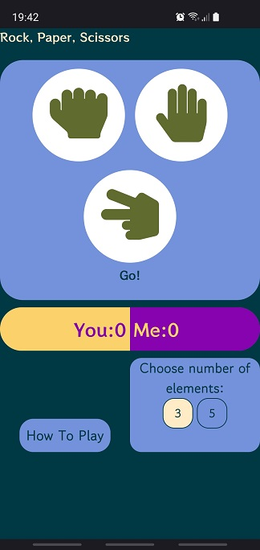
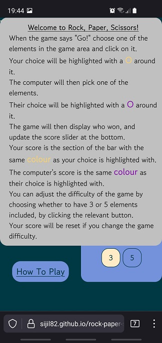  
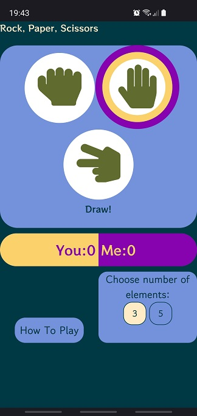
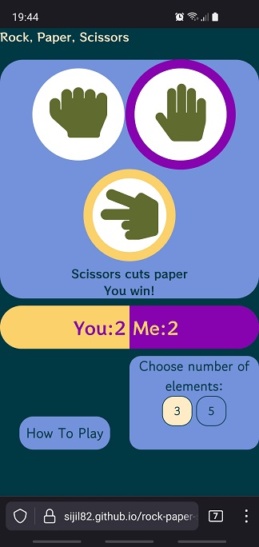  
### Chrome on Windows Desktop
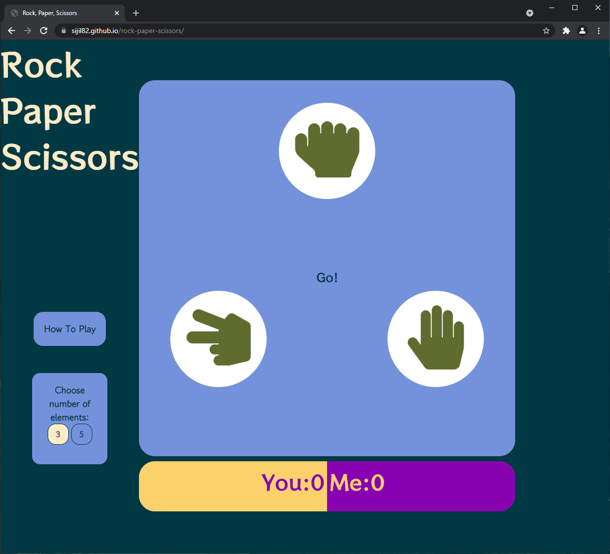  
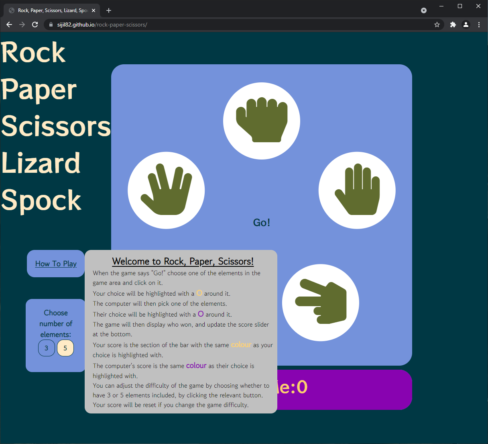  
  
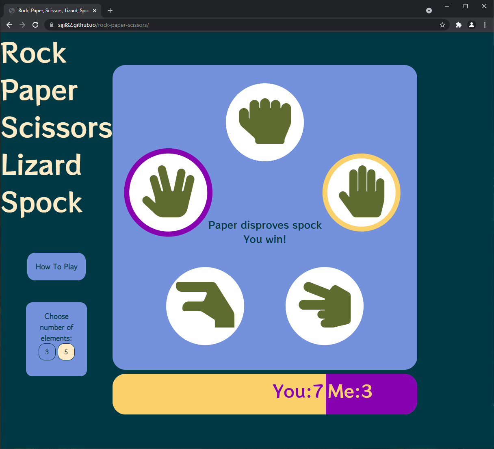  
### Chrome on Android
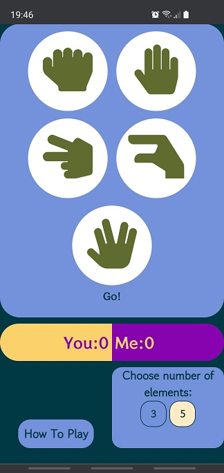
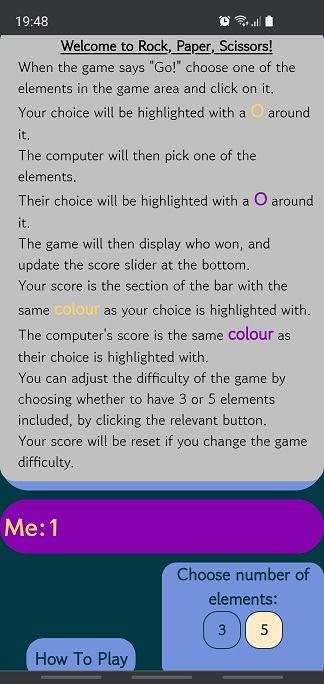  
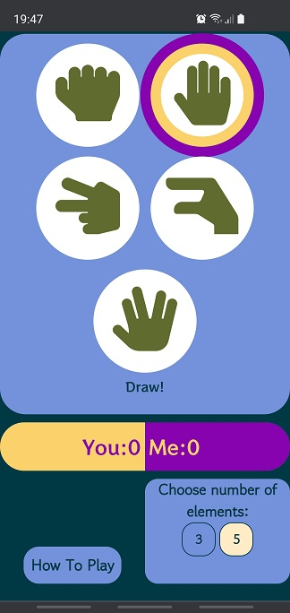
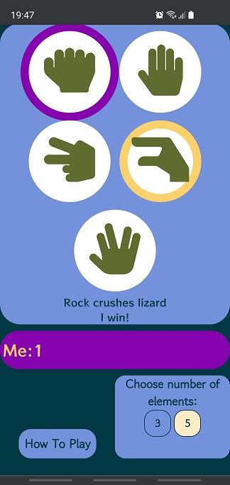  
### Firefox on iPad
Note that this was simulated using the Developer Tools in a desktop web browser
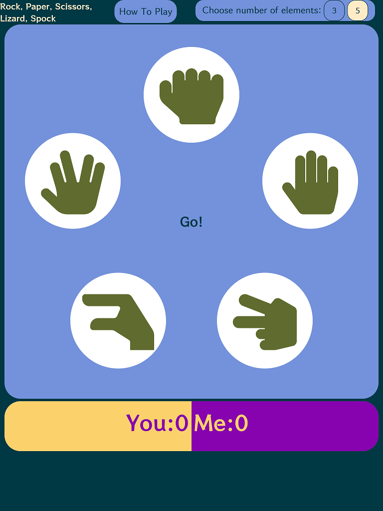  
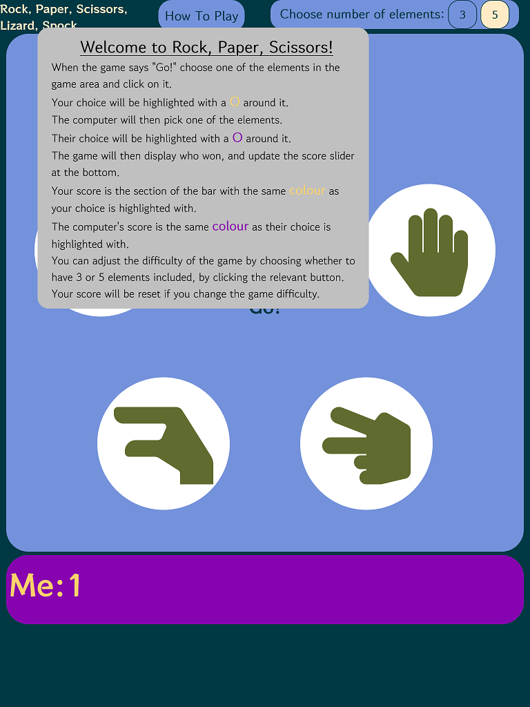  
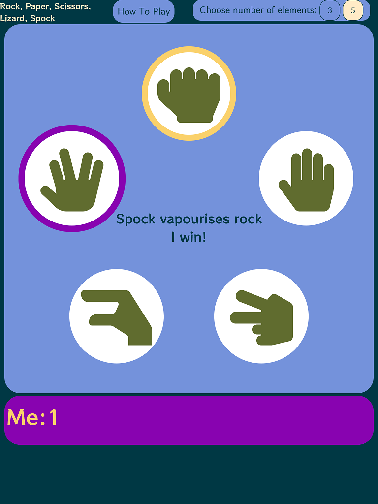  
## Responsive Design Testing
The site is fully responsive, and elements will re-arrange and resize to fit different resolution and orientation screens:
### 1920x1080
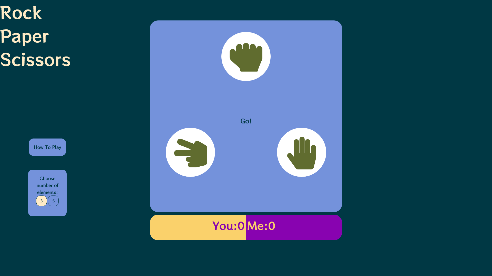  
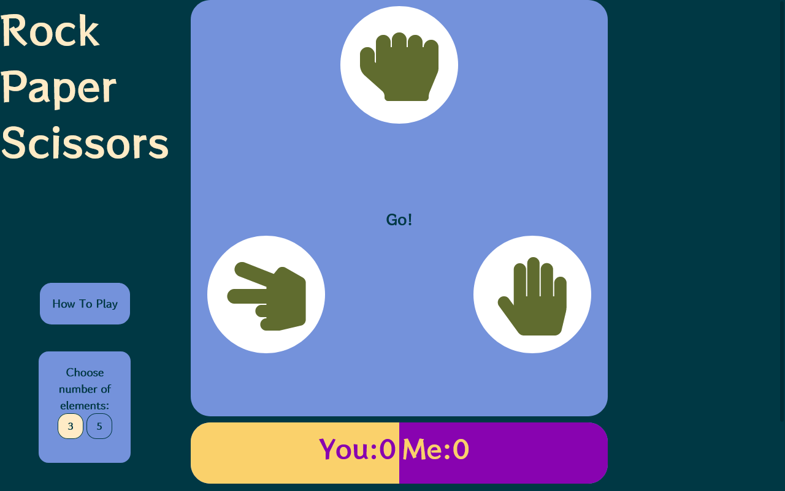  
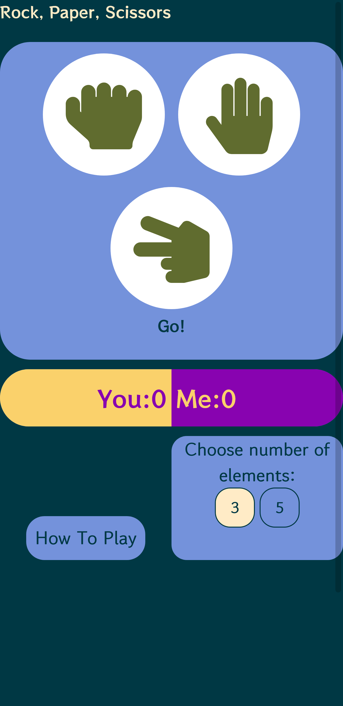  
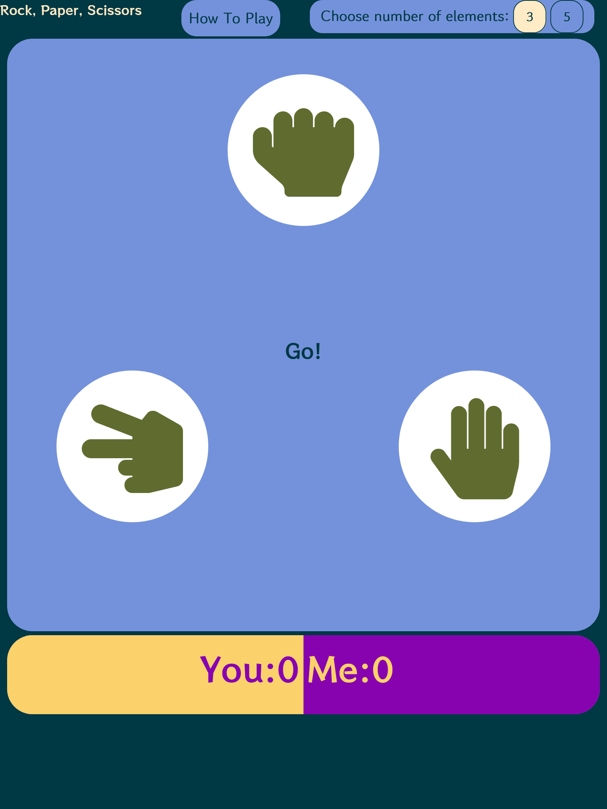  
Note that if testing the site responsiveness in a browser and changing the resolution, the page will need to be refreshed after each resize to allow the javascript to position dynamic elements correctly.  
This does not affect normal usage of the site where the resolution is not being freely resized.  
## Validator Testing
- __The site has been tested with the following validators:__
    - ### HTML
        - [W3C HTML Validation](https://validator.w3.org/nu/?doc=https%3A%2F%2Fsijil82.github.io%2Frock-paper-scissors%2F)  
        - No issues found:
        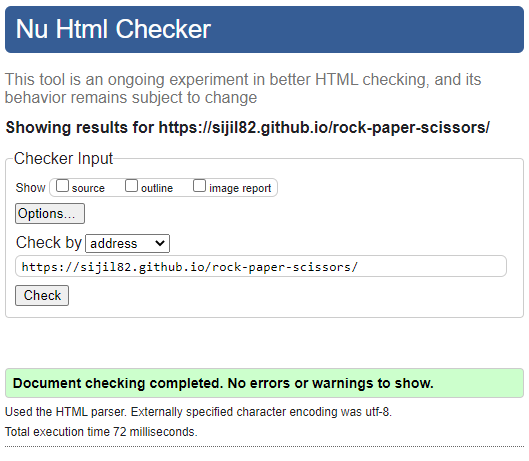  
    - ### CSS
        - [W3C CSS Validator](https://jigsaw.w3.org/css-validator/validator?uri=https%3A%2F%2Fsijil82.github.io%2Frock-paper-scissors%2F&profile=css3svg&usermedium=all&warning=1&vextwarning=&lang=en)
        - A number of warnings and errors are returned, however these are all because the validator tool is not up to date with the current CSS specifications.  
        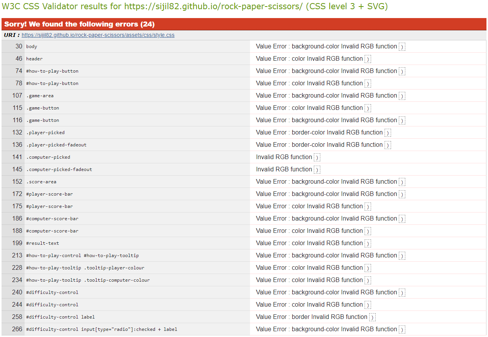  
        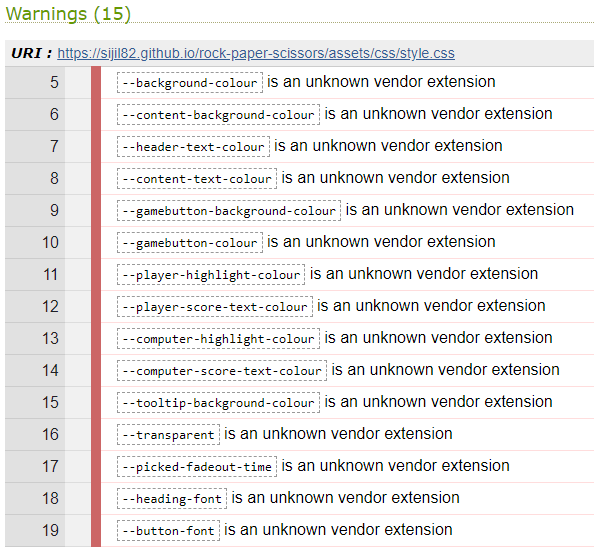  
        - The `Value Error : border-bottom Invalid RGB function ) `, `Invalid RGB function )` errors and `is an unknown vendor extension` warnings are due to the validator not supporting custom CSS properties, which have been a valid part of the CSS specification for a number of years, as per https://github.com/w3c/css-validator/pull/173  
        - The CSS in use that throws these errors is valid, legal CSS. 
## Bugs
- __Known Issues__
    - There is 1 known issue with the site - when in a mobile / reduced width display where the How To Play and Difficulty boxes are beneath the main game area, the How To Play tooltip can be toggled by clicking in the empty space above the button, as well as on the button itself. 
        - This space is a margin, and therefore should not trigger a click event, so it is unknown as to why this occurs.
# Deployment

# Credits
https://stackoverflow.com/questions/50149925/click-event-target-gives-element-or-its-child-not-parent-element
https://grid.layoutit.com/
https://www.tutorialrepublic.com/faq/how-to-change-the-cursor-into-a-hand-pointer-on-hover-using-css.php
https://www.w3schools.com/howto/howto_css_tooltip.asp